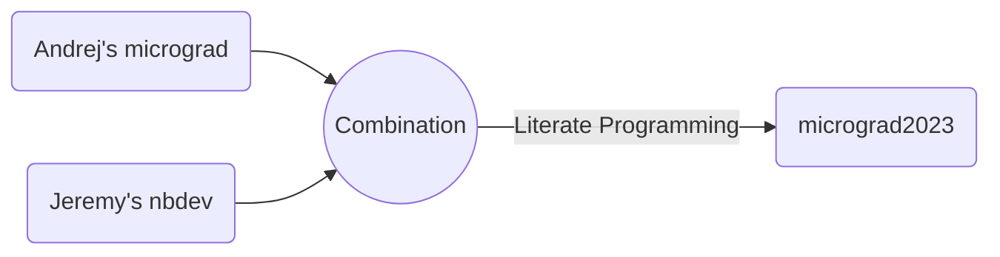

# micrograd2023


<!-- WARNING: THIS FILE WAS AUTOGENERATED! DO NOT EDIT! -->


## Literate Programming




## Disclaimers

`micrograd2023`, an automatic differentiation software, was developed
based on [Andrej Karpathy’s](https://karpathy.ai/)
[micrograd](https://github.com/karpathy/micrograd).

Andrej is the man who needs no introduction in the field of Deep
Learning and Computer Vision. He released a series of lectures called
[Neural Network from Zero to
Hero](https://karpathy.ai/zero-to-hero.html), which I found extremely
educational and practical. I am reviewing the lectures and creating
notes for myself and for teaching purposes.

`mirograd2023` was written using [nbdev](https://nbdev.fast.ai/), which
was developed by [Jeremy Howard](https://jeremy.fast.ai/), the man who
needs no introduction in the field of Deep Learning. Jeremy also created
`fastai` Deep Learning software [library](https://docs.fast.ai/) and
[Courses](https://course.fast.ai/) that are extremely influential. I
highly recommend `fastai` if you are interested in starting your journey
and learning with ML and DL.

`nbdev` is a powerful tool that can be used to efficiently develop,
build, test, document, and distribute software packages all in one
place, Jupyter Notebook (I used Jupyter Notebooks in VS Code). In this
tutorial, you will learn how to use `nbdev` to develop software
`micrograd2023`.

## Demonstrations

- A detailed demonstration of `micrograd2023` for training and
  integrating MLP can be found in this [MLP
  DEMO](https://hdocmsu.github.io/micrograd2023/mlp_demo.html).

- A demonstration of `micrograd2023` for Physics for
  auto-differentiation of a popular cosine function can be found in this
  [Physics Cosine
  DEMO](https://hdocmsu.github.io/micrograd2023/phys_demo_cos.html).

  - Comparing the `micrograd2023` results with the analytical solutions,
    `pytorch`’s autograd, and `jax`’s autograd.
  - Additionally, second-order derivatives are calculated using `jax`’s
    autograd.
  - it is possible to use `jax`’s autograd to calculate higher-order
    derivatives.

- A demonstration of `micrograd2023` for Physics for
  auto-differentiation of a popular exponential decay function can be
  found in this [Physics Exp.
  DEMO](https://hdocmsu.github.io/micrograd2023/phys_demo_exp.html).

- A demonstration of `micrograd2023` for Physics for
  auto-differentiation of a damping function can be found in this
  [Physics Damp
  DEMO](https://hdocmsu.github.io/micrograd2023/phys_demo_damp.html).

- A demonstration of `micrograd2023` for MRI for auto-differentiation of
  a T2\* decay model of data acquired from a multi-echo UTE sequence.
  Additionally, the auto-differentiations then be used to calculate the
  Fisher Information Matrix (FIM), which then allows calculations of
  Cramer-Rao Lower Bound (CRLB) of an un-bias estimator of T2\*. Details
  can be seen at [MRI T2\* Decay
  DEMO](https://hdocmsu.github.io/micrograd2023/mri_demo_expdecay.html).

- A demonstration of `micrograd2023` for MRI for auto-differentiation of
  a T1 recovery model of data acquired from a myocardial MOLLI T1
  mapping sequence. Additionally, the auto-differentiations then be used
  to calculate the Fisher Information Matrix (FIM), which then allows
  calculations of Cramer-Rao Lower Bound (CRLB) of an un-bias estimator
  of T1. Details can be seen at [MRI T1 Recovery
  DEMO](https://hdocmsu.github.io/micrograd2023/mri_demo_exprec.html).

## Features

Compared to Andrej’s `micrograd`, `micrograd2023` has many extensions
such as:

- Adding more and extensive unit and integration tests.

- Adding more methods for
  [`Value`](https://hdocmsu.github.io/micrograd2023/engine.html#value)
  object such as `tanh()`, `exp()`, and `log()`. In principle, any
  method/function with known derivative or can be broken into primitive
  operations can be added to the
  [`Value`](https://hdocmsu.github.io/micrograd2023/engine.html#value)
  object. Examples are `sin()`, `sigmoid()`, `cos()`, etc., which I left
  as exercises 😄.

- Refactoring Andrej’s demo code make it easier to demonstrate many
  fundamental concepts and/or best engineering practices when training
  neural network. The concepts/best-practices are listed below. Some
  concepts were demonstrated while the rest are left as exercises 😄.

  - Always implemented a simplest and most intuitive solution as a
    baseline to compare with whatever fancy implementations we want to
    achieve

  - Data preparation - train, validation, and test sets are disjointed

  - Over-fitting

  - Gradient Descent vs. Stochastic Gradient Descent (SGD)

  - Develop and experiment with different optimizations i.e. SGD, SGD
    with momentum, rmsProp, Adam, etc.

  - SGD with momentum

  - Non-Optimal learning rate

  - How to find the optimal learning rate

  - Learning rate decay and learning rate schedule

  - Role of nonlinearity

  - Linear separable and non-separable data

  - Out of distribution shift

  - Under-fitting

  - The importance and trade-off between width and depth of the MLP

  - Over-fitting a single-batch

  - Hyperparameter tuning and optimizing

  - Weights initialization

  - Inspect and visualize statistics of weights, gradients, gradient to
    data ratios, and update to data ratios

  - Forward and backward dynamics of shallow and deep linear and
    non-linear Neural Network

  - etc.

If you study lectures by Andrej and Jeremy you will probably notice that
they are both great educators and utilize both top-down and bottom-up
approaches in their teaching, but Andrej predominantly uses *bottom-up*
approach while Jeremy predominantly uses *top-down* one. I personally
fascinated by both educators and found values from both of them and hope
you are too!

## Related Projects

Below are a few of my projects related to optimization and Deep
Learning:

- Diploma Research on Crystal Structure using Gradient-based
  Optimization
  [SLIDES](https://hdocmsu.github.io/projects/ictp_1_thesis/)

- Deep Convolution Neural Network (DCNN) for MRI image segmentation with
  uncertainty quantification and controllable tradeoff between False
  Positive and False Negative. [Journal Paper
  PDF](https://hdocmsu.github.io/assets/pdf/papers/do_mrm2019.pdf) and
  [Conference Talk
  SLIDES](https://hdocmsu.github.io/assets/pdf/slides/2018-10-28-HungDo_MLworkshop2018_web.pdf)

- Deep Learning-based Denoising for quantitative MRI. [Conference Talk
  SLIDES](https://hdocmsu.github.io/assets/pdf/slides/2019-02-06-HungDo_dnoiseNET_web.pdf)

- Besides technical projects, I had an opportunity to contribute and
  engage in the whole process of 510(k) FDA clinical validation of Deep
  Learning-based MRI Reconstruction resulting the worlds-first fully
  integrated Deep Learning-based Reconstruction Technology to receive
  Food and Drug Administration (FDA) 510(k)-clearance for use in
  clinical environment. [Product
  Page](https://us.medical.canon/products/magnetic-resonance/aice/),
  [Whitepaper
  HTMLs](https://us.medical.canon/products/magnetic-resonance/experience/),
  [Whitepaper
  PDF](https://canonmedical.widen.net/content/t3vj2i3kwt/original/637271900181629483SK.pdf?u=vmbupa&),
  and [Whitepaper
  PDF2](https://canonmedical.widen.net/content/u72d0f4vuh/original/637309925416001229SG.pdf?u=vmbupa&)

  - [AiCE Challenge
    1](https://us.medical.canon/promo/magnetic-resonance/aice/1/): 1.5T
    MRI with Deep Learning Reconstruction (DLR) vs. 3T MRI

  - [AiCE Challenge
    2](https://us.medical.canon/promo/magnetic-resonance/aice/2/): 1.5T
    MRI with DLR vs. 3T MRI - beyond knee and brain MRI

  - [AiCE Challenge
    3](https://us.medical.canon/promo/magnetic-resonance/aice/3/):
    Faster and Higher Resolution MRI with DLR

  - [AiCE Challenge
    4](https://us.medical.canon/promo/magnetic-resonance/aice/4/):
    Faster MRI with DLR

## How to install

The [micrograd2023](https://pypi.org/project/micrograd2023/) package was
uploaded to [PyPI](https://pypi.org/) and can be easily installed using
the below command.

`pip install micrograd2023`

### Developer install

If you want to develop `micrograd2023` yourself, please use an editable
installation.

`git clone https://github.com/hdocmsu/micrograd2023.git`

`pip install -e "micrograd2023[dev]"`

You also need to use an editable installation of
[nbdev](https://github.com/fastai/nbdev),
[fastcore](https://github.com/fastai/fastcore), and
[execnb](https://github.com/fastai/execnb).

Happy Coding!!!

## How to use

Here are examples of using micrograd2023.

``` python
# import necessary objects and functions
from micrograd2023.engine import Value
from micrograd2023.nn import Neuron, Layer, MLP
from micrograd2023.utils import draw_dot
import random
```

``` python
# inputs xs, weights ws, and bias b
w1 = Value(1.1)
x1 = Value(0.5)
w2 = Value(0.12)
x2 = Value(1.7)
b = Value(0.34)

# pre-activation
s = w1*x1 + x2*w2 + b

# activation
y = s.tanh()

# automatic differentiation
y.backward()

# show the computation graph of the perceptron
draw_dot(y)
```


``` python
# added random seed for reproducibility
random.seed(1234)
n = Neuron(3)
x = [Value(0.15), Value(-0.21), Value(-0.91) ]
y = n(x)
y.backward()
draw_dot(y)
```


You can use `micrograd2023` to train a MLP and learn fundamental
concepts such as overfilling, optimal learning rate, etc.

Good training


Overfitting


## Testings

To perform unit testing, using terminal to navigate to the directory,
which contains `tests` folder, then simply type `python -m pytest` on
the terminal. Note that,
[PyTorch](https://pytorch.org/get-started/locally/) is needed for the
test to run since derivatives calculated using `micrograd2023` are
compared against those calculated using `PyTorch` as references.

`python -m pytest`
