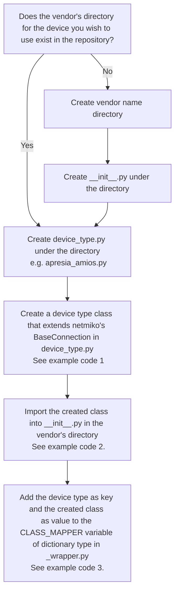

NetmikoLibrary
==============
NetmikoLibrary is a Robot Framework library that provides SSH/Telnet connections to network devices and enables operations on the CLI.

This section describes the structure of NetmikoLibrary and how to extend it.

If you want to know how to use keywords, please refer to the following  
→※libdocのurl

## Architecture
---------------
NetmikoLibrary with the following structure:
```
NetmikoLibrary
├── README.md
├── __init__.py
├── _wrapper.py
├── <vender_name>
│   ├── __init__.py
│   └── <device_type>.py
...etc
```

-  **_wrapper.py**  
Wraps the netmiko package and defines functions that can be used as keywords in the RobotFramework.  
The functions defined here are limited to those defined in netmiko. (e.g. `connect()`, `send_command()`)  

- **<vender_name>/<device_type>.py**  
User-defined classes to use device types not supported by the netmiko package.   
[List of supported device types](https://github.com/ktbyers/netmiko/blob/develop/netmiko/ssh_dispatcher.py)  
See below for how to define them.

How to incorporate User-defined classes
---------------
If the device you want to test is not supported by netmiko, you must define your own class to extend the Library.  
When incorporating user-defined classes, please perform the following steps:  



### example code 1
Example of when you want to use the following device:  
vendor: apresia  
device_type: amios
```python
# apresia/apresia_amios.py
from netmiko import BaseConnection


class Amios(BaseConnection):
    """Apresia AMIOS's class"""

(snip) 

class AmiosSSH(Amios):
    pass


class AmiosTelnet(Amios):
    pass
```

### example code 2
Import the defined class
```python
# apresia/__init__.py
from .apresia_amios import AmiosSSH, AmiosTelnet

__all__ = ["AmiosSSH", "AmiosTelnet"]
```
### example code 3
Add device_type and created class as key and value to CLASS_MAPPER_BASE_ALT for ssh and CLASS_MAPPER_ALT for telnet  
```python
# _wrapper.py
from .apresia.apresia_amios import AmiosSSH, AmiosTelnet

(snip) 
# add ssh driver
CLASS_MAPPER_BASE_ALT["apresia_amios"] = AmiosSSH

(snip) 
# add telnet driver
CLASS_MAPPER_ALT["apresia_amios_telnet"] = AmiosTelnet

(snip) 
```
