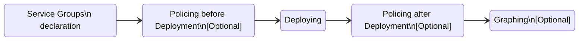

# Purpose

Wouldn't be nice to script your GCP infrastructure without having to learn a new language ?

# Description

This package simplifies the deployment of GCP services through the gcloud command line.

# Installation

`pip install pygcloud`

# Features

* Leverage `gcloud` command line tool
* Be as transparent to `gcloud` as possible
* Capability to group deployment of services together
* Capability to describe relationships between services
* Capability to perform trial runs
* [Policing before deployment](./feature_policy.md)
* Policing after deployment (FUTURE)
* Graph generation and diagramming (WIP)

# Categories of Services

1. SingletonImmutable e.g. Firestore indexes
2. RevisionBased e.g. Cloud Run service with revisions
3. Updatable e.g. GCS bucket

For the "SingletonImmutable" category, we ignore exceptions arising from the service already being created. The "describe" facility might be or not available.

For the "RevisionBased", we skip the "update" step. The "create" method will be called. The "describe" facility might be or not available.

For the "Updatable", we do the complete steps i.e. describe, create or update.

# Example Usage

A longer example is available [here](./example_usage.md)

```python
from pygcloud.models import Param, EnvParam, service_groups
from pygcloud.gcp.services.storage import StorageBucket
from pygcloud.deployer import Deployer

# Retrieve parameter from environment variables
# Useful in the context of using Cloud Build
project_id = EnvParam("--project", "_PROJECT_ID")

# The 'common_params' will be added at the end of the gcloud command
# The Deployer can be reused for multiple services
deployer = Deployer(common_params=[project_id])

# Create a group for a number of services
srv_group_common = service_groups.create("common")

# The first parameter is the name. Most services require a unique name.
# `params_create` correspond to the gcloud parameters pertinent
# to the `create` method.
# e.g. gcloud storage buckets create my-bucket
#
bucket = StorageBucket("my-bucket",
    params_create=["--public-access-prevention"],
    params_update=["--public-access-prevention"])

#
# Any number of services can be added to a group
#
srv_group_common.append(bucket)

# Deploy the service
# For Storage Buckets, an existence check is done using the `describe` gcloud command
# before creating or updating the bucket.

# Which group of services to deploy
# This parameter can come from the environment e.g. Cloud Build
#
# In this case, we only have 1 group defined "common".
# If the environment variable `_SRV_GROUP` contains `common`,
# all the services associated with this group defined here
# will get deployed. If `_SRV_GROUP` is not specified in the
# environment variables, the group `main` is assumed.
srv_group_name = EnvValue("_SRV_GROUP", default="main")

deployer.deploy(srv_group_name)
```

Additional usage tips can be found in the `tests/gcp.services` folder.

# Use relationships

Some services have explicit relationship(s) with other services e.g. 

* Forwarding Rule and IP Address
* Cloud Run and Service Account, Region
* Backend Service and IAP, Forwarding Rule
* Certificate and domain
* Forwarding Rule and TargetHTTPSProxies
* HTTPSProxy and Certificate, URL Map
* Scheduler and Pubsub Topic
* Cloud Run NEG and Region
* URL Map and Backend Service 
* etc.

Many relationships are also explicit through `IAM bindings`.

Some relationships are valuable but cannot be obtained through service specifications nor IAM bindings. The main culprits are `default service accounts` with their large binding scope: the ability to determine precisely the "real" relationships between services is compromised.

## Relationships to external services (FUTURE)

`pygcloud` supports specifying relationships between GCP services and external ones. 

# Architecture

Below is the list of the major components of this package:

* Service Groups
* Deployer
* Policer
* Linker
* Grapher

Service Groups hold much of the state necessary for the proper functionning of the core capabilities of this package.



The architecture relies internally on `hooks` (aka `callbacks`) in order to operate with an additional level of decoupling between components.  The internal `hooks` are setup the `__init__` phase of `pygcloud`.

## Policing

Each policy defined (as derived class from `Policy`) gets automatically added to the list of policers in scope for evaluation.

When the `Policer.police` classmethod is invoked, each policy is evaluated against each service declared in the service groups.

## Linker

After a deployment, more information is available because the service specification are often returned by default by GCP.

The Linker executes automatically and collects this additional information set.

# About GCP Labels (**being re-assessed**)

Labels optionally carry the "use" relationships between service instances.

We work with the limitations (i.e. 64 entries, unique key names, value length limited to 63 characters) of GCP's labeling capability in the following manner:

1. Each relationship takes 1 label
2. Each label key is composed like so:  *`pygcloud-use-$index`*
3. The corresponding label value:  *`$ns--$name`*

The field `$name` is sometimes encoded since the value contains characters not supported by GCP. Encoding strategy in these cases is always the same (bas64 with custom alphabet, padding `=` removed).

# About Regions and Locations

Some services are more difficult to inventory than others. This is the case for Cloud Scheduler for example: `gloud scheduler jobs list` command requires specifying the `--location` where to perform the listing.

# About Python 3.9

The gcloud command line is currently built for Python 3.9. The accompanied Docker image provided by Google is built for Python 3.9. To simplify usage of pygcloud, I opted to follow this gcloud constraint.

# EntryPoints

This package supports entrypoints. They are defined in the package's `pyproject.toml` file. The prototypes of the callables can be found in the `pygcloud.events` module.

# Adding support for other services

* Add data model to `pygcloud.gcp.models`
* Add servoce class in a module in `pygcloud.gcp.services`
* Add support for graphing in `pygcloud.gcp.linker`

# TODO

* Explain why "delete" operations are not supported
* File bug report about GCS not supporting --clear-labels along with --update-labels (as in Cloud Run as example)
* File bug report about Cloud Scheduler listing requiring --location (whilst most other services do not)
* Implement simple retry policy to help manage spurious errors
* Redo ServiceAccountIAM class
* Policy: check for cross-project service accounts
* Task Queue: accepts Service Account
* Pubsub Subscription: push and pull models

# Links

* [Repository](https://github.com/jldupont/pygcloud)
* [Pypi](https://pypi.org/project/pygcloud/)
* [GCP Labels](https://cloud.google.com/compute/docs/labeling-resources)
