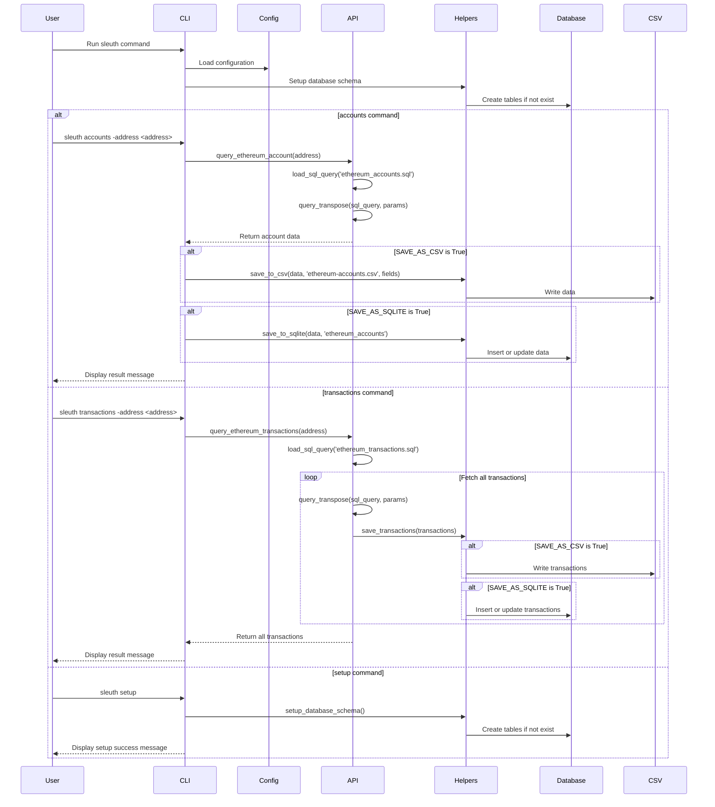

<h1 align="center">Sleuth Kit 🔍</h1>

<p align="center">
  <b>Sleuth kit provides a suite of tools for blockchain intelligence.</b>
</p>

<p align="center">
  <a href="https://github.com/sleuthfi/sleuth-kit/blob/main/LICENSE">
    
  </a>
</p>

## What is Sleuth Kit?

Sleuth Kit is a suite of tools for blockchain intelligence. It is designed to be a flexible and extensible framework for investigating and building blockchain intelligence tools.



Currently, data is saved locally in a CSV file and SQLite database. The data can then be uploaded to Xata for long-term storage and querying. The settings for data storage are configurable in the `config.py` file.

Visualization of the data is also planned to be supported in the future.

## Why was Sleuth Kit created?

Sleuth Kit was created due to the limitation of free and publicly available blockchain labels and other data that would be useful in blockchain OSINT. It is designed to be a flexible and extensible framework for compiling your own Data Lake of blockchain data and using it to build custom tools.

## ⛓️ Currently Supported Chains

- Ethereum
- Bitcoin (WIP)

## ⚙️ Installation

1. Clone the repository:

   ```
   git clone https://github.com/sleuthfi/sleuth-kit.git
   ```

2. Navigate to the project directory:

   ```
   cd sleuth-kit
   ```

3. Install dependencies using Poetry:

   ```
   poetry install
   ```

## 💼 Usage

1. Setup the database schema:

   ```
   poetry run sleuth setup
   ```

2. Query Ethereum account data:

   ```
   poetry run sleuth accounts -address 0xe3E182bC39951F99AF86d8CD0c42a4B7C4CD93F7

3. Query Ethereum transaction data:

   ```
   poetry run sleuth transactions -address 0xe3E182bC39951F99AF86d8CD0c42a4B7C4CD93F7

## 🔧 Configuration

Ensure that the `.env` file is set up with the following variables:

- `TRANSPOSE_API_KEY`: Your Transpose API key
- `XATA_API_KEY`: Your Xata API key
- `XATA_DB_URL`: Your Xata database URL

## 📜 License

### This project is licensed under the [AGPL-3.0 License](https://github.com/sleuthfi/sleuth-kit/blob/main/LICENSE)
